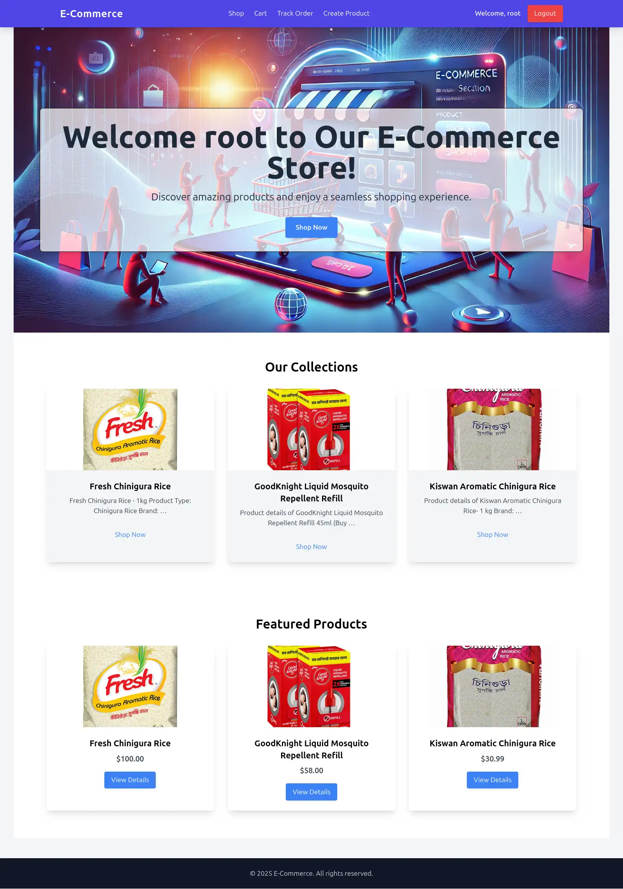
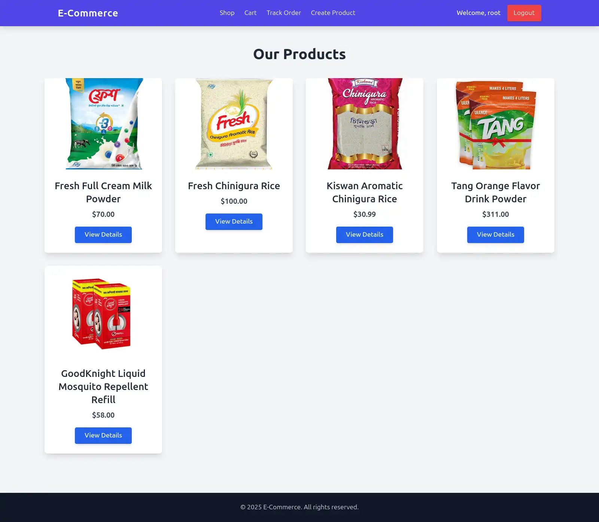
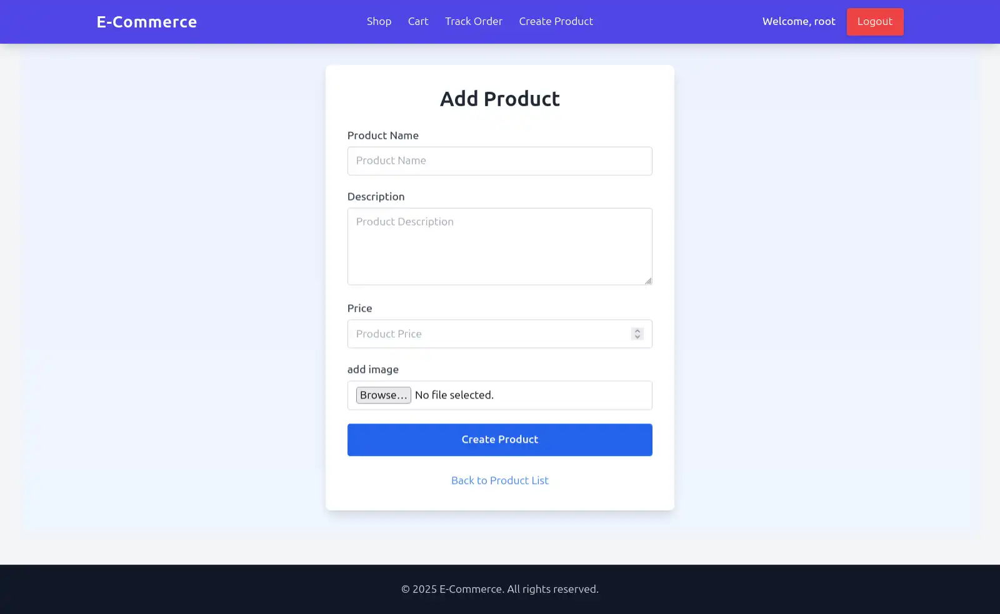
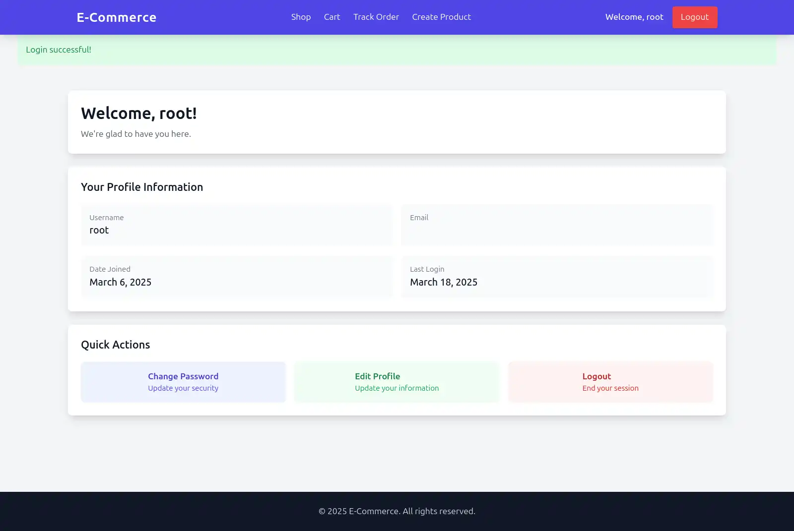

# 🌟 eCommerce Store (Django & Tailwind CSS) 🎮

Welcome to **eCommerce Store**, a modern eCommerce web application built using **Django** and **Tailwind CSS**. This project allows users to browse products, add items to their cart, place orders, and manage authentication.  

## ✨ Features  

- 🛒 **Product Listing & Detail Pages**  
- 🔍 **Search & Filter Products**  
- 🎁 **Shopping Cart & Checkout System**  
- 🔑 **User Authentication (Login, Register, Logout)**  
- 📦 **Order Tracking System**  
- 🎨 **Tailwind CSS for Beautiful UI**  

## 🛠️ Technologies Used  

- **🖥️ Backend:** Django, Django ORM  
- **🎨 Frontend:** Tailwind CSS, HTMX  
- **📂 Database:** SQLite (default), can be switched to PostgreSQL/MySQL  
- **🚀 Deployment:** Gunicorn, Nginx (for production)  

## ⚡ Installation & Setup  

Follow these steps to set up the project locally:  

### 1⃣ Clone the Repository  
```sh
git clone https://github.com/yourusername/ecommerceProject.git
cd ecommerceProject
```  

### 2⃣ Create a Virtual Environment  
```sh
python -m venv venv
source venv/bin/activate  # On Windows use `venv\Scripts\activate`
```  

### 3⃣ Install Dependencies  
```sh
pip install -r requirements.txt
```  

### 4⃣ Apply Migrations  
```sh
python manage.py migrate
```  

### 5⃣ Create a Superuser 👤  
```sh
python manage.py createsuperuser
```  

### 6⃣ Run the Development Server 🚀  
```sh
python manage.py runserver
```
Then visit **🔗 http://127.0.0.1:8000/** in your browser.  

## 🌍 Deployment Guide  

To deploy the project on a live server (e.g., **Heroku, DigitalOcean, AWS**):  

- ⚙️ Use **Gunicorn** as the WSGI server.  
- 🐈️ Set up **PostgreSQL** for production.  
- 🌐 Configure **Nginx** or **Caddy** as a reverse proxy.  
- 🐳 Use **Docker** for containerization (optional).  

## 📸 Screenshots  

  
  
  
  

## 🤝 Contributing  

Pull requests are welcome! For major changes, please open an **issue** first to discuss what you would like to change.  

## 🐟 License  

This project is licensed under the **MIT License**.  

---  

🌟 **Star this repository** if you found it useful! 🚀💙

